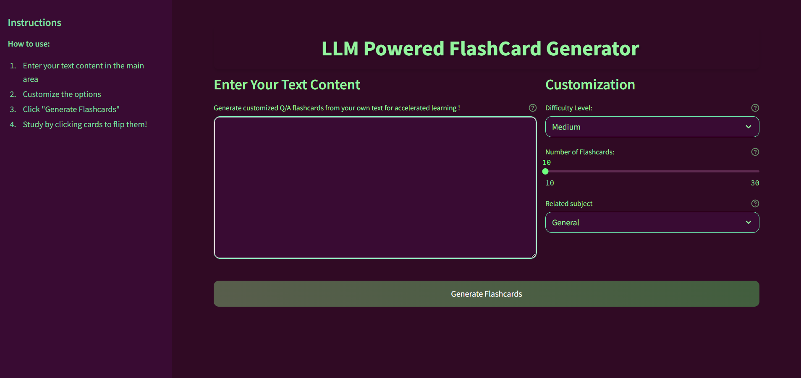

# LLM based Flash Card generator (Gemini)

 

 
## Flashcard Generation Tool that utilizes Large Language Models (LLMs) to convert educational content into effective question-answer flashcards. This tool is expected to demonstrate LLM integration capabilities, simple user interaction, and clean code practices.

## [Demo page](https://shelfexaiml.streamlit.app/)

## Features

- 🏭 Generate flashcards from text content
- ⚖ Adjustable flashcard count (10-30 cards)
- 👁️ Show/hide all answers with one click
- 🔄 Randomize card order
- 📥 Download flashcards as JSON, CSV


## Prerequisites

- Python 3.9+
- Google Gemini API key
- Streamlit
- python-dotenv


## Installation

1. Clone the repository:
    ```bash
    git clone https://github.com/MrParindiyal/shelfex-aiml.git
    cd shelfex-aiml
    ```

2. Create and activate a virtual environment (Linux-like):
    ```bash
    python -m venv .venv
    source .venv/bin/activate  
    ```
- For Windows: 
    ```powershell
    python -m venv .venv
    .\.venv\Scripts\activate  
    ```


3. Create a .env file in the project root with your API key:
    ```bash
    GEMINI_KEY= 'your_gemini_api_key'
    ```

4. Run the app
    ```ps
      pip install -r requirements.txt -q
      streamlit run frontend.py
    ```

- Alternatively, this will automatically download python libs and start streamlit (Linux only)

  ```bash
    sudo chmod +x run.sh
    ./run.sh
  ```


## Deploying on StreamLit Community Cloud

1. Fork the repository

2. Login to Streamlit Cloud Dashboard

3. Deploy the app from the repository

4. Set `GEMINI_KEY` under App Settings > Secrets:
   ```bash
   GEMINI_KEY= 'your_gemini_api_key'
   ```
## Usage

1. Run the application:
   ```bash
   streamlit run frontend.py
   ```

2. In your browser:
    - Paste your text content in the text area

    - Customize generation parameters if needed

    - Click "Generate Flashcards"

    - Use the toggles to view/hide answers

    - Download the flashcards as JSON/CSV when done


## Available Configurations

Customize the application through the sidebar:
  - Minimum Flashcards: Set how many cards to generate (10-20)
  - Difficulty : Easy, Medium, Hard (also influences the word length)
  - Subject : "General" by default


## Screenshot

 

## Sample
### Input:
<pre style="white-space: pre-wrap;">
Cryptography, or cryptology (from Ancient Greek: κρυπτός, romanized: kryptós "hidden, secret"; and γράφειν graphein, "to write", or -λογία -logia, "study", respectively), is the practice and study of techniques for secure communication in the presence of adversarial behavior. More generally, cryptography is about constructing and analyzing protocols that prevent third parties or the public from reading private messages. Modern cryptography exists at the intersection of the disciplines of mathematics, computer science, information security, electrical engineering, digital signal processing, physics, and others. Core concepts related to information security (data confidentiality, data integrity, authentication, and non-repudiation) are also central to cryptography. Practical applications of cryptography include electronic commerce, chip-based payment cards, digital currencies, computer passwords, and military communications. Cryptography prior to the modern age was effectively synonymous with encryption, converting readable information (plaintext) to unintelligible nonsense text (ciphertext), which can only be read by reversing the process (decryption). The sender of an encrypted (coded) message shares the decryption (decoding) technique only with the intended recipients to preclude access from adversaries. The cryptography literature often uses the names "Alice" (or "A") for the sender, "Bob" (or "B") for the intended recipient, and "Eve" (or "E") for the eavesdropping adversary. Since the development of rotor cipher machines in World War I and the advent of computers in World War II, cryptography methods have become increasingly complex and their applications more varied. Modern cryptography is heavily based on mathematical theory and computer science practice; cryptographic algorithms are designed around computational hardness assumptions, making such algorithms hard to break in actual practice by any adversary. While it is theoretically possible to break into a well-designed system, it is infeasible in actual practice to do so. Such schemes, if well designed, are therefore termed "computationally secure". Theoretical advances (e.g., improvements in integer factorization algorithms) and faster computing technology require these designs to be continually reevaluated and, if necessary, adapted. Information-theoretically secure schemes that provably cannot be broken even with unlimited computing power, such as the one-time pad, are much more difficult to use in practice than the best theoretically breakable but computationally secure schemes. The growth of cryptographic technology has raised a number of legal issues in the Information Age. Cryptography's potential for use as a tool for espionage and sedition has led many governments to classify it as a weapon and to limit or even prohibit its use and export. In some jurisdictions where the use of cryptography is legal, laws permit investigators to compel the disclosure of encryption keys for documents relevant to an investigation. Cryptography also plays a major role in digital rights management and copyright infringement disputes with regard to digital media. Terminology diagram showing shift three alphabetic cypher D becomes A and E becomes B Alphabet shift ciphers are believed to have been used by Julius Caesar over 2,000 years ago. This is an example with k = 3. In other words, the letters in the alphabet are shifted three in one direction to encrypt and three in the other direction to decrypt. The first use of the term "cryptograph" (as opposed to "cryptogram") dates back to the 19th century—originating from "The Gold-Bug", a story by Edgar Allan Poe. Until modern times, cryptography referred almost exclusively to "encryption", which is the process of converting ordinary information (called plaintext) into an unintelligible form (called ciphertext). Decryption is the reverse, in other words, moving from the unintelligible ciphertext back to plaintext. A cipher (or cypher) is a pair of algorithms that carry out the encryption and the reversing decryption. The detailed operation of a cipher is controlled both by the algorithm and, in each instance, by a "key". The key is a secret (ideally known only to the communicants), usually a string of characters (ideally short so it can be remembered by the user), which is needed to decrypt the ciphertext. In formal mathematical terms, a "cryptosystem" is the ordered list of elements of finite possible plaintexts, finite possible cyphertexts, finite possible keys, and the encryption and decryption algorithms that correspond to each key. Keys are important both formally and in actual practice, as ciphers without variable keys can be trivially broken with only the knowledge of the cipher used and are therefore useless (or even counter-productive) for most purposes. Historically, ciphers were often used directly for encryption or decryption without additional procedures such as authentication or integrity checks. There are two main types of cryptosystems: symmetric and asymmetric. In symmetric systems, the only ones known until the 1970s, the same secret key encrypts and decrypts a message. Data manipulation in symmetric systems is significantly faster than in asymmetric systems. Asymmetric systems use a "public key" to encrypt a message and a related "private key" to decrypt it. The advantage of asymmetric systems is that the public key can be freely published, allowing parties to establish secure communication without having a shared secret key. In practice, asymmetric systems are used to first exchange a secret key, and then secure communication proceeds via a more efficient symmetric system using that key. Examples of asymmetric systems include Diffie–Hellman key exchange, RSA (Rivest–Shamir–Adleman), ECC (Elliptic Curve Cryptography), and Post-quantum cryptography. Secure symmetric algorithms include the commonly used AES (Advanced Encryption Standard) which replaced the older DES (Data Encryption Standard). Insecure symmetric algorithms include children's language tangling schemes such as Pig Latin or other cant, and all historical cryptographic schemes, however seriously intended, prior to the invention of the one-time pad early in the 20th century. In colloquial use, the term "code" is often used to mean any method of encryption or concealment of meaning. However, in cryptography, code has a more specific meaning: the replacement of a unit of plaintext (i.e., a meaningful word or phrase) with a code word (for example, "wallaby" replaces "attack at dawn"). A cypher, in contrast, is a scheme for changing or substituting an element below such a level (a letter, a syllable, or a pair of letters, etc.) to produce a cyphertext. Cryptanalysis is the term used for the study of methods for obtaining the meaning of encrypted information without access to the key normally required to do so; i.e., it is the study of how to "crack" encryption algorithms or their implementations. Some use the terms "cryptography" and "cryptology" interchangeably in English, while others (including US military practice generally) use "cryptography" to refer specifically to the use and practice of cryptographic techniques and "cryptology" to refer to the combined study of cryptography and cryptanalysis. English is more flexible than several other languages in which "cryptology" (done by cryptologists) is always used in the second sense above. RFC 2828 advises that steganography is sometimes included in cryptology. The study of characteristics of languages that have some application in cryptography or cryptology (e.g. frequency data, letter combinations, universal patterns, etc.) is called cryptolinguistics. Cryptolinguistics is especially used in military intelligence applications for deciphering foreign communications.
</pre>
### Output:

[JSON File](static/flashcards.json)

[CSV File](static/flashcards.csv)

```json
[
  {
    "question": "What are the core concepts central to cryptography?",
    "answer": "Data confidentiality, data integrity, authentication, and non-repudiation are central to cryptography."
  },
  {
    "question": "What are the two main types of cryptosystems?",
    "answer": "The two main types of cryptosystems are symmetric and asymmetric systems."
  },
  {
    "question": "What is the main advantage of asymmetric systems?",
    "answer": "Asymmetric systems' public key can be freely published, enabling secure communication without a shared secret key."
  },
  {
    "question": "What are some examples of asymmetric systems?",
    "answer": "Examples of asymmetric systems include Diffie-Hellman key exchange, RSA, ECC, and Post-quantum cryptography."
  },
  ...
  ...
  ..
]
```